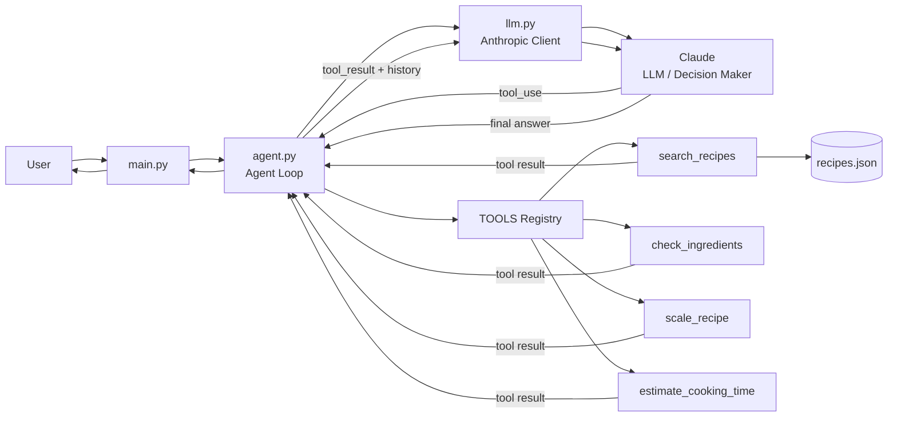

# Meal Planning Agent

A CLI meal planning agent that uses Claude with explicit tool calling to search local recipes, check ingredients, estimate cooking time, and scale servings. Answers stay grounded in deterministic Python tools and a local recipe catalog.

## Table of contents

- [Features](#features)
- [Architecture](#architecture)
- [Quick start](#quick-start)
- [Configuration](#configuration)
- [Usage](#usage)
- [Tools](#tools)
- [Testing](#testing)
- [Project structure](#project-structure)
- [Design decisions](#design-decisions)
- [Limitations](#limitations)
- [Roadmap](#roadmap)

## Features

- **Constraint-aware planning** — respects diet, time limits, available ingredients, and serving size
- **Explicit agent loop** — small, readable orchestration in `agent.py` 
- **Deterministic tools** — search, ingredient checks, scaling, and time estimates are pure Python
- **Local recipe catalog** — offline-friendly `recipes.json` (20 recipes)
- **Observable runs** — terminal logs for each step, tool call, and tool result
- **Unit tested** — tool logic and LLM client setup covered without live API calls

## Architecture

The project is split into four layers. Each file has one job, which keeps the flow easy to follow and test.


| Layer         | File           | Responsibility                                                                     |
| ------------- | -------------- | ---------------------------------------------------------------------------------- |
| Entry         | `main.py`      | Load config, read user input, create the LLM client, run the agent, print progress |
| Orchestration | `agent.py`     | Tool-use loop: call Claude → run tools → append results → repeat until done        |
| LLM           | `llm.py`       | Anthropic Messages API client; normalizes responses into text and tool calls       |
| Tools         | `tools.py`     | Recipe functions, JSON schemas for Claude, and the `TOOLS` name→function registry  |
| Data          | `recipes.json` | Static recipe catalog read by tool functions                                       |


### System overview




### Control flow in `agent.py`

1. Start with the user message in a `messages` list.
2. Call Claude with conversation history, tool schemas, and a system prompt.
3. **If Claude requests tools** — validate and run each tool, append results to `messages`, go to step 2.
4. **If Claude returns text** — return it as the final answer.
5. **If `MAX_AGENT_STEPS` is reached** — return a fallback message.

The application owns execution: only registered tools in `TOOLS` can run, required arguments are validated against `TOOL_SCHEMAS`, and errors are returned as tool observations so Claude can recover on the next turn.

## Quick start

### Prerequisites

- Python 3.12+
- An [Anthropic API key](https://console.anthropic.com/)

### Install

```bash
git clone https://github.com/Keerthans097/meal-planning-agent/

python -m venv .venv

# Windows
.venv\Scripts\activate

# macOS / Linux
source .venv/bin/activate

pip install -r requirements.txt
```

### Configure

```bash
# Windows
copy .env.example .env

# macOS / Linux
cp .env.example .env
```

Edit `.env` and set your API key:

```env
ANTHROPIC_API_KEY=your_key_here
ANTHROPIC_MODEL=claude-sonnet-5
MAX_AGENT_STEPS=8
```

### Run

```bash
python main.py
```

## Configuration


| Variable            | Required | Default           | Description                               |
| ------------------- | -------- | ----------------- | ----------------------------------------- |
| `ANTHROPIC_API_KEY` | Yes      | —                 | Anthropic API key for Claude              |
| `ANTHROPIC_MODEL`   | No       | `claude-sonnet-5` | Model ID passed to the Messages API       |
| `MAX_AGENT_STEPS`   | No       | `8`               | Maximum agent loop iterations per request |


## Usage

After starting the CLI, enter a multi-line meal request. Press Enter on a blank line when finished.

**Example prompt:**

```text
I want a quick vegetarian pasta for 2 people under 20 minutes.
I have pasta, tomatoes, garlic, spinach, and olive oil.
```

**Example terminal output:**

```text
[USER]
I want a quick vegetarian pasta for 2 people under 20 minutes.
...

[STEP 1]
[TOOL CALL] search_recipes
  args: {"query": "vegetarian pasta spinach"}

[TOOL RESULT] search_recipes
  result: {"status": "ok", "matches": [...], "count": 1}

[STEP 2]
[TOOL CALL] check_ingredients
...

[AGENT]
Here is my recommendation: Quick Spinach Pasta ...
```

Log tags:


| Tag             | Meaning                                  |
| --------------- | ---------------------------------------- |
| `[USER]`        | Your input request                       |
| `[CONFIG]`      | Active model and step limit              |
| `[STEP n]`      | Agent loop iteration                     |
| `[TOOL CALL]`   | Tool name and arguments chosen by Claude |
| `[TOOL RESULT]` | JSON result returned by the tool         |
| `[AGENT]`       | Final answer (or max-steps message)      |


## Tools


| Tool                    | Input                             | Output                                                                             |
| ----------------------- | --------------------------------- | ---------------------------------------------------------------------------------- |
| `search_recipes`        | `query` (string)                  | Top recipe matches ranked by name/ingredient overlap; rejects generic-only queries |
| `check_ingredients`     | `recipe`, `available_ingredients` | Available vs. missing ingredients and match percentage                             |
| `scale_recipe`          | `recipe`, `servings`              | Ingredient list scaled to target servings                                          |
| `estimate_cooking_time` | `recipe`                          | Cooking time in minutes from recipe metadata                                       |


Tool schemas in `tools.py` are sent to Claude on every LLM call so the model knows which functions exist and what arguments they expect.

## Testing

```bash
pytest -v
```


| Test file             | Coverage                                                 |
| --------------------- | -------------------------------------------------------- |
| `tests/test_tools.py` | Search ranking, ingredient checks, scaling, cooking time |
| `tests/test_llm.py`   | API key validation and client setup (no network calls)   |


## Project structure

```text
cooking-agent/
├── main.py              # CLI entrypoint, config, progress logging
├── agent.py             # Agent loop and tool dispatch
├── llm.py               # Anthropic client and response parsing
├── tools.py             # Tool implementations, schemas, and registry
├── recipes.json         # Local recipe catalog (20 recipes)
├── tests/
│   ├── test_tools.py
│   └── test_llm.py
├── requirements.txt
├── pytest.ini
├── .env.example
└── README.md
```

## Design decisions

### Why an explicit agent loop?

Claude decides **which** tool to call and **when**. The app decides **how** tools run. Keeping the loop in `agent.py` makes control flow visible, debuggable, and easy to unit test without a framework.

### Why Claude?

The Anthropic Messages API supports first-class tool use. `llm.py` maps directly to `messages.create(..., tools=...)` and parses `tool_use` blocks.

### Why no LangChain / LangGraph?

The orchestration is small and explicit in `agent.py`. A framework would add abstraction without reducing complexity for this scope.

### Why local JSON?

Recipes are deterministic, fast, and testable offline. Swapping `recipes.json` for a database or API later only requires changes in `tools.py`.


